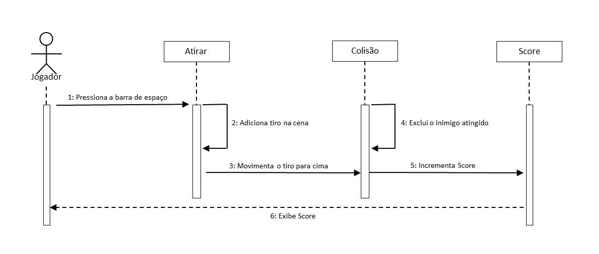

# Análise orientada a objeto
<!-- > [!NOTE]
> 
A <strong>análise</strong> orientada a objeto consiste na descrição do problema a ser tratado, duas primeiras etapas da tabela abaixo, a definição de casos de uso e a definição do domínio do problema.
 -->

## Descrição Geral do domínio do problema

O problema consiste no desenvolvimento de um jogo de tiro 2D, onde o jogador controla um personagem que deve atirar em zumbis que descem da parte superior da tela. O objetivo é eliminar os zumbis, acumular pontos e evitar que um destes atravesse a margem inferior da tela. O jogo oferece controles para movimentação do personagem, disparos, pausa, e reinício do jogo.
O ambiente do jogo é simples e jogador deve reagir rapidamente aos inimigos que surgem e movem-se em direção à base da tela. A geração dos inimigos é aleatória, e o jogador deve gerenciar a movimentação, especialmente quando surgirem zumbis corredores.

### Requisitos Funcionais

- **Movimentação do Jogador**: O jogador deve poder mover seu personagem para a esquerda, direita, cima e baixo utilizando as teclas direcionais do teclado.

- **Tiros**: O jogador deve ser capaz de efetuar disparos para cima.

- **Zumbis**: Zumbis devem aparecer periodicamente na parte superior da tela, em posição aleatoriamente definida, se mover para baixo e ser deletado ao ser atingido por um tiro ou ultrapassar a margem inferior da tela.

- **Colisões**: Quando um tiro atingir um zumbi, este deve ser removido da tela e o jogador deve computar um ponto no score.

- **Pausa e Retorno ao Jogo**: O jogador deve ser capaz de pausar o jogo ao pressionar a tecla "P".

- **Reinício do Jogo**: O jogo deve reiniciar ao pressionar a tecla "R", restaurando o estado inicial, posição do jogador, pontuação e geração de inimigos.

- **Exibição de Pontuação**: A pontuação do jogador deve ser exibida na tela e ser atualizada cada vez que um inimigo é destruído.

- **Fim de Jogo**: O jogo deve encerrar quando um inimigo atingir a parte inferior da tela sem ser destruído, ou quando o jogador for atingido por um inimigo.

- **Mensagens**: O jogo deve mostrar continuamente o Score e as instruções de uso e deve mostrar (quando acionados), as mensagens de ativação de Pause e Game Over.

## Requisitos Não-Funcionais

- **Desempenho**: Deve funcionar de forma fluida, mantendo uma taxa de quadros constante, mesmo com múltiplos inimigos na tela.

- **Usabilidade**: A interface de usuário deve ser amigável, com instruções sobre os controles e a pontuação visíveis.

- **Escalabilidade**: Deve ser capaz de lidar com um número crescente de inimigos sem que isso afete seu desempenho.

- **Qualidade Visual**: Deve ter elementos gráficos facilmente identificáveis e animações de boa qualidade.

- **Estabilidade**: O jogo deve ser estável, com o mínimo possível de falhas durante a execução, especialmente em relação à detecção de colisões e ao movimento de objetos.

- **Manutenção**: O código do jogo deve ser organizado de modo que facilite a manutenção.

## Diagrama de Caso de Uso

O Diagrama de Casos de Uso apresenta as principais funcionalidades do sistema e suas interações com o jogador. Ele ilustra de forma simplificada as ações realizadas, tais como movimentar-se, realizar disparos, pausar ou reiniciar o jogo, além das funcionalidades internas, como o gerenciamento de inimigos, colisões e pontuação.

## Diagrama de Sequência

O diagrama de sequência tem como objetivo ilustrar a interação entre os objetos do sistema ao longo do tempo, representando a troca de mensagens e a ordem em que ocorrem. No contexto deste jogo, o diagrama de sequência do tiro mostra como diferentes componentes interagem para processar um tiro, desde a entrada do jogador até a remoção do tiro, colisão com um inimigo e cômputo de Score.

 
## Diagrama de Domínio do problema

O diagrama de Domínio do Problema apresenta uma visão geral dos principais elementos do sistema, além de suas relações e responsabilidades dentro do contexto do jogo. Ele destaca os atores principais, como o jogador, os inimigos, os tiros, a cena do jogo, e mostra como esses elementos interagem entre si.

[Retroceder](README.md) | [Avançar](projeto.md)

