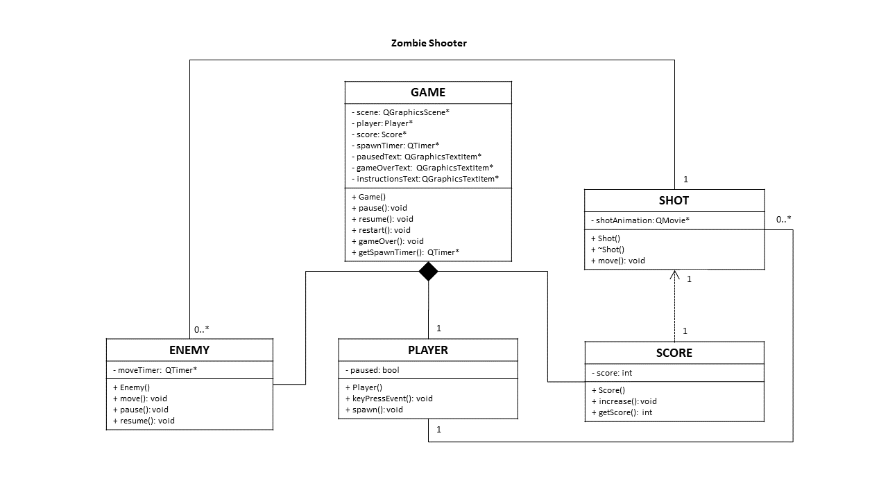

# Projeto orientado a objeto

<!-- >[!NOTE]
>O **Projeto orientado a objeto** é composto pelas documentação do projeto descrito em UML. Deve incluir um Diagrama de Classes do sistema projetado, e pelo menos um diagrama de interação de um dos casos de uso. Outros diagramas podem ser apresentados, caso julgue necessário. -->

## Diagrama de Classes

O diagrama de classes descreve a estrutura do sistema de forma objetiva, destacando as principais classes envolvidas no desenvolvimento do projeto. Ilustra os atributos e métodos de cada classe, bem como os relacionamentos entre elas, heranças, associações, responsabilidades e interações.

[Retroceder](analise.md) | [Avançar](implementacao.md)

